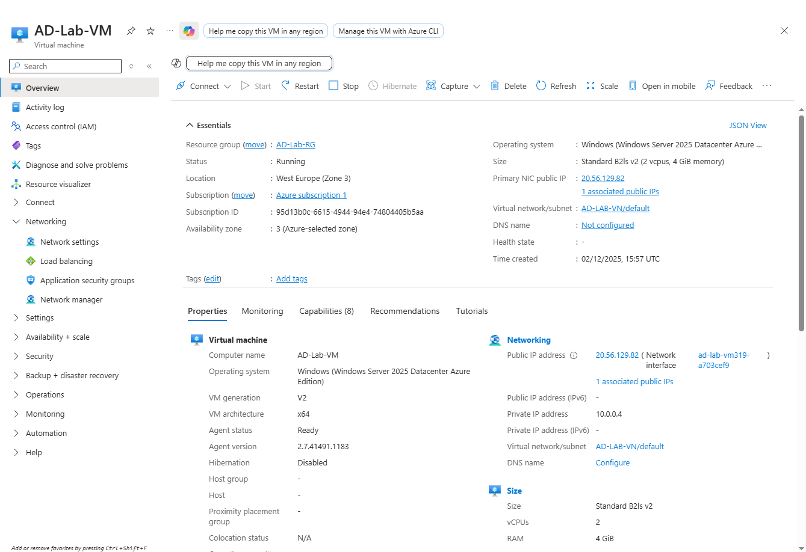

# 🛠 Active Directory Lab in Azure (Windows Server 2025)

This project is a hands-on Active Directory lab built entirely in Microsoft Azure.  
It recreates a real enterprise IT environment with a Windows Server 2025 Domain Controller.  
The goal is to demonstrate core IT support skills including domain creation, DNS, user management, RDP, and Azure VM administration.

---

# 🎯 Project Overview

This lab simulates a real on-premises IT environment using cloud-hosted Azure VMs.

**Completed so far:**

- Deployed a Windows Server 2025 Azure VM  
- Assigned static private IP for DC reliability  
- Installed Active Directory Domain Services  
- Promoted server to a Domain Controller  
- Created the forest/domain `lab.local`  
- Logged in using domain credentials (`lab\labadmin`)  

This environment is ideal for practising IT Support, Desktop Support, Service Desk, and junior Sysadmin tasks.

---

# ☁️ Azure Infrastructure Setup

## 1️⃣ Resource Group  
- **Name:** `AD-Lab-RG`  
- **Region:** West Europe  

---

## 2️⃣ Virtual Network  
- **VNet:** `AD-Lab-VNet`  
- **Subnet:** `default`  
- **Address Space:** `10.0.0.0/24`

---

## 3️⃣ Windows Server 2025 Virtual Machine  
- **VM Name:** `AD-Lab-VM`  
- **Size:** `B2ls_v2`  
- **OS:** Windows Server 2025 Datacenter  
- **Inbound Ports:** RDP (3389)

---

## 4️⃣ Network Interface + Static IP  
- Enabled static private IP to support domain controller functions  
- Ensures DNS and authentication stability  

**NIC settings:**

**Static Private IP:**

---

# 🛠 Active Directory Domain Setup

## 1️⃣ Installed AD DS Role  
Using Server Manager → Add Roles and Features → Active Directory Domain Services

---

## 2️⃣ Promoted to Domain Controller  
Created a new forest:

- **Domain:** `lab.local`  
- DNS configured automatically  
- Server rebooted after installation  

**Domain Controller Confirmation:**

---

## 3️⃣ Logged in Using Domain Credentials  
Signed in as:
labadmin@LAB.LOCAL

---

# 🧠 Skills Demonstrated So Far

### 🔹 Azure Skills
- Deploying virtual machines  
- Network Interface configuration  
- Static IP assignment  
- Managing VNets and subnets  
- RDP connectivity troubleshooting  

### 🔹 Windows Server Skills
- Installing server roles  
- Managing Server Manager  
- Understanding domain controllers  
- DNS configuration  

### 🔹 Active Directory Skills
- Creating a new forest and domain  
- Promoting a server to Domain Controller  
- Logging in with domain credentials  
- Understanding domain structure  

This already demonstrates Tier 1 and Tier 2 support capabilities.

---

# 📸 Screenshots

| Description | Image |
|------------|--------|
| Azure Resource Group |  |
| Azure VM Overview |  |
| Network Interface |  |
| Static Private IP Configuration |  |
| Domain Controller Confirmation |  |

---

# 🚀 Upcoming Features (Planned)

Next, this lab will expand into a full help desk / sysadmin environment:

### ✔ Create Organizational Units (OUs)  
### ✔ Add realistic users (20–50 recommended)  
### ✔ Create security groups  
### ✔ Implement Group Policy (GPOs)  
- Password policy  
- Desktop wallpaper  
- Software restriction  
- Mapped drives  
- Screen lock timeout  

### ✔ Deploy Windows 11 VM  
- Join it to the domain  
- Sign in as a domain user  

### ✔ Help Desk Scenarios  
- Password resets  
- Unlocking user accounts  
- Permissions fixes  
- Group membership updates  
- Printer access tasks  
- Map network drives  
- DNS troubleshooting  

---

# 🧑‍💻 Author  
**Mohammad Masood (mullvad25)**  
Aspiring IT Support & Systems Engineer  
Focused on infrastructure, cloud, networking, and enterprise IT tools.

---

# 🌐 Purpose of This Lab  
This project is meant to:

- Build real job-ready IT skills  
- Strengthen a professional portfolio  
- Prove hands-on technical ability to recruiters  
- Prepare for IT Support, Help Desk, Desktop Support, and Sysadmin roles  

---

